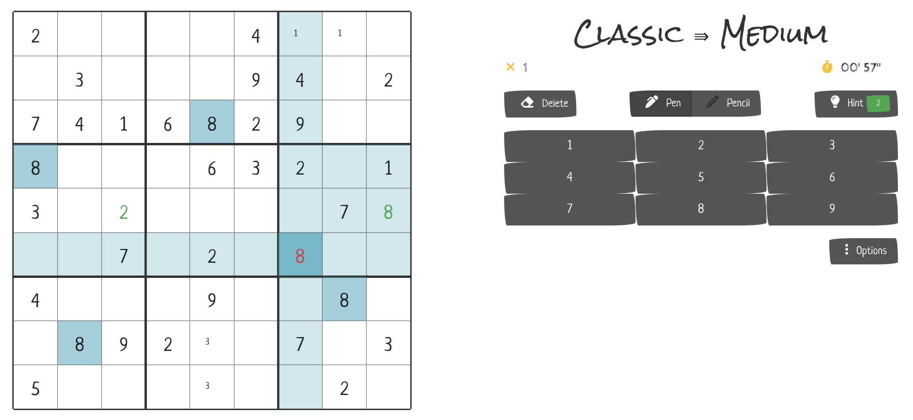

# Sudoku

Yeap. As you might think, this is yet another game development project of mine.
If you haven't done it yet, I highly recommend checking the other ones I have on GitHub:

- [Pacman](https://github.com/virgs/pacman)
- [Minesweeper AI](https://github.com/virgs/minesweeper-ai)
- [Flappy Bird AI](https://github.com/virgs/flappy-bird-ai)
- [2048 AI](https://github.com/virgs/2048-ai)
- [Rubik's Cubes AI](https://github.com/virgs/rubiks-cubes-ai)
- [Mancala](https://github.com/virgs/mancala)
- [Tetris](https://github.com/virgs/tetris)

## Overview

This project is dedicated to the art of Sudoku puzzles, their abstractions, and their variations.
*Sudoku killer* was for a long time the puzzle I had fun with before bed. To be honest, I was never attracted to code it, simply because it didn't seem challenging enough.

However, things changed when I added some artificial constraints:

1. **Sudoku Variations**: Immerse yourself in the fascinating world of Sudoku, exploring different abstractions and variations (mini, classic, killer, and puzzle).
2. **React Project**: improve my React skills and increase my HTML/CSS proficiency. No game engine at all. The code abstraction must be good enough to handle any type of dimension and variation of the Sudoku grid.
3. **Have fun**: Most of the games I've coded recently were practically forgotten as soon as their last commit was pushed. I needed one that not only could I play later, but I wanted to. Some record stats would be nice too.

I got really satisfied with the results. [Check it yourself](https://virgs.github.io/sudoku).
